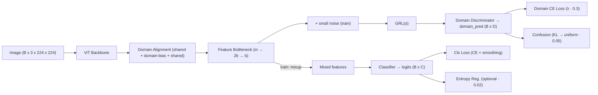

---

# ViT-AlignMix-DANN (VAMD) — Detailed README

**এক লাইনে:** ViT backbone + Domain Alignment + Feature Bottleneck + Mixup + DANN (GRL + Domain Discriminator) দিয়ে মাল্টি-সোর্স ডেটার **ডোমেইন শিফট** সামলে **রোবাস্ট ক্লাসিফিকেশন**।

## সূচিপত্র

* [মোটিভেশন](#মোটিভেশন)
* [আর্কিটেকচার ও ডেটা-ফ্লো](#আর্কিটেকচার-ও-ডেটা-ফ্লো)
* [ফরোয়ার্ড পাসের ছদ্ম-কোড](#ফরোয়ার্ড-পাসের-ছদ্ম-কোড)
* [কম্পোনেন্টস ডিটেইলস](#কম্পোনেন্টস-ডিটেইলস)
* [লস ফাংশন ও স্কেজ্যুলিং](#লস-ফাংশন-ও-স্কেজ্যুলিং)
* [হাইপারপ্যারামিটার গাইড](#হাইপারপ্যারামিটার-গাইড)
* [ইনস্টলেশন ও ডেটা প্রিপ্রসেসিং](#ইনস্টলেশন-ও-ডেটা-প্রিপ্রসেসিং)
* [ট্রেনিং রেসিপি](#ট্রেনিং-রেসিপি)
* [ইভ্যালুয়েশন ও রিপোর্টিং](#ইভ্যালুয়েশন-ও-রিপোর্টিং)
* [ট্রাবলশুটিং](#ট্রাবলশুটিং)
* [কনফিগ কিজ (from\_config)](#কনফিগ-কিজ-from_config)
* [এক্সটেনশন আইডিয়া](#এক্সটেনশন-আইডিয়া)
* [লাইসেন্স ও ক্রেডিট](#লাইসেন্স-ও-ক্রেডিট)

---

## মোটিভেশন

বাস্তব ডেটা বিভিন্ন **ডোমেইন** (ক্যামেরা, কম্প্রেশন, লাইটিং) থেকে আসে → **ডোমেইন শিফট**। সোজা ক্লাসিফায়ার সাধারণত সোর্স থেকে টার্গেটে **জেনারেলাইজ** করতে পারে না।
**VAMD** এই সমস্যা সমাধান করে ৩ভাবে:

1. **ViT** → শক্তিশালী, গ্লোবাল কনটেক্সট ফিচার
2. **DomainAlignment + Bottleneck + Mixup** → ফিচার **কমপ্যাক্ট/রেগুলারাইজড** ও ডোমেইন-সামঞ্জস্যপূর্ণ
3. **DANN (GRL + Discriminator)** → ফিচারকে **ডোমেইন-ইনভারিয়্যান্ট** করতে অ্যাডভার্সেরিয়াল চাপ

---

## আর্কিটেকচার ও ডেটা-ফ্লো



**শেপ উদাহরণ (B=8, ViT-B/32):**

* `x`: `[8, 3, 224, 224]`
* `backbone(x)`: `[8, 768]`
* `DomainAlignment`: `[8, 768]`
* `Bottleneck` (b=512): `[8, 512]`
* `Classifier logits` (C=2): `[8, 2]`
* `DomainDiscriminator` (D=3): `[8, 3]`

---

## ফরোয়ার্ড পাসের ছদ্ম-কোড

```python
def forward(x, domain_labels=None, inference=False):
    alpha = 0.0 if inference else calculate_alpha()

    # 1) Backbone features
    feat = backbone(x)                 # B×F

    # 2) Domain alignment (shared → +bias → shared)
    aligned = DomainAlignment(feat, domain_labels)   # B×F

    # 3) Bottleneck (in→2b→b)
    h = FeatureBottleneck(aligned)     # B×b

    # 4) Mixup (train only)
    z = mixup_features(h) if training else h

    # 5) Classifier
    logits = classifier(z)             # B×C

    # 6) Domain branch (train + alpha>0)
    if training and alpha > 0:
        noisy = h + 0.005 * randn_like(h)
        rev = grad_reverse(noisy, alpha)
        domain_pred = domain_discriminator(rev)      # B×D
    else:
        domain_pred = domain_discriminator(h)        # B×D

    return logits, domain_pred, h
```

---

## কম্পোনেন্টস ডিটেইলস

### ViT Backbone

* ইমেজ → `P×P` প্যাচ → লিনিয়ার/কনভ প্রজেকশন → টোকেন
* পজিশনাল এমবেডিং + ট্রান্সফরমার এনকোডার → ফিচার
* আমাদের কোডে হেড `Identity`, তাই **ফিচার ভেক্টর** পাই।
* **প্রিট্রেইনড ওয়েট** (CLIP/ViT) নিলে **কম ডেটাতেও** ভালো।

### DomainAlignment

* **Shared transform:** `Linear→BN→ReLU` (সব ডোমেইনের জন্য একই)
* **Domain-specific bias:** প্রতিটি ডোমেইনের জন্য একটি শিখনযোগ্য ভেক্টর; train+labels থাকলে যোগ হয়
* **Shared projection:** আবার `Linear→BN→ReLU`
* **কেন:** কম প্যারামে ফিচারকে **কমন স্পেসে** আনা, domain shift কমানো

### FeatureBottleneck

* `in_dim → 2b → b` দুই ধাপের `Linear+BN+ReLU+Dropout`
* **কেন:** বড়, নোইজি ফিচার → **কমপ্যাক্ট/রেগুলারাইজড**; ওভারফিটিং কম; ক্লাসিফায়ার/ডিসক্রিমিনেটর সহজে শেখে

### Feature-level Mixup

* `x_mix = λ x + (1-λ) x_perm`, λ\~Beta(α,α)
* **কেন:** ডিসিশন বাউন্ডারি স্মুথ, জেনারেলাইজেশন বেটার
* **নোট:** এখানে লেবেল মিক্স করা হয়নি; ক্লাস লসে **label smoothing (0.1)** আছে

### DANN Branch (GRL + Discriminator)

* **Noise (+0.005σ)** → সহজ ক্লু থেকে রোবাস্ট
* **GRL(α):** forward-এ কিছু না; backward-এ **-α** গুনে গ্র্যাড রিভার্স → ফিচার এক্সট্রাক্টর **ডোমেইন-ইনফো লুকাতে** শেখে
* **Discriminator:** `Linear→BN→LeakyReLU→Dropout` × k → `Linear(num_domains)`

---

## লস ফাংশন ও স্কেজ্যুলিং

### 1) Classification Loss

* `cls_loss = CE(logits, labels, label_smoothing=0.1)`
* স্মল ডেটা/নয়েজে ক্যালিব্রেশন ও ওভারফিটিং কমায়

### 2) Domain CE Loss

* `domain_loss = CE(domain_pred, domain_labels)`
* ওজন: `λ * 0.3`
* `λ` ধীরে বাড়ে:
  `p = clip(num_updates / 8000, 0, 1)`
  `λ = (2 / (1 + exp(-8p)) - 1)` → `[0..1]` তারপর `*0.3`

### 3) Confusion Loss (KL→uniform)

* `p_d = softmax(domain_pred)`
* `conf = KL( log p_d || uniform )`
* ওজন: `0.05`
* উদ্দেশ্য: ডোমেইন প্রেডিকশন **অস্পষ্ট** রাখা → ফিচার domain-invariant

### 4) Entropy Regularization (optional)

* `cls_probs = softmax(logits)`
* `entropy = -mean( sum( p*log(p) ) )`
* ওজন: `0.02` (কনফিডেন্স/ক্যালিব্রেশন ব্যালান্স)

### 5) GRL Strength α (Training only)

* `p = clip(num_updates / 10000, 0, 1)`
* `α_raw = 2/(1+exp(-8p)) - 1` → `[0..1]`
* `α = 0.7 * α_raw`
* শুরুতে কম, পরে বেশি → ট্রেনিং স্থির থাকে

**Overall Loss:**

```
overall = cls
        + (λ * 0.3) * domain
        + 0.05 * confusion
        + 0.02 * entropy
```

---

## হাইপারপ্যারামিটার গাইড

| প্যারাম               | ডিফল্ট | নোট                                |
| --------------------- | -----: | ---------------------------------- |
| `num_classes`         |      2 | বাইনারি: real/fake                 |
| `num_domains`         |      3 | সোর্স ডোমেইনের সংখ্যা              |
| `bottleneck_dim`      |    512 | 256–1024 ট্রাই; ডেটা/কম্পিউট দেখে  |
| `dropout`             |    0.3 | বটলনেক/ক্লাসিফায়ার/ডিসক্রিমিনেটরে |
| `mixup_alpha`         |    0.3 | 0.2–0.4; ব্যাচ ≥ 2 দরকার           |
| `num_unfrozen_blocks` |      6 | ViT শেষের ব্লক আনফ্রিজ ফাইন-টিউনে  |
| `pretrained`          |   True | timm/CLIP ViT ওয়েট                 |

**অপ্টিমাইজার:**

* `AdamW(lr=3e-4, weight_decay=0.05)`
* **Scheduler:** cosine decay + warmup (1–10k steps)

---

## ইনস্টলেশন ও ডেটা প্রিপ্রসেসিং

```bash
pip install torch torchvision timm numpy
```

**Transforms (CLIP ViT-B/32 উদাহরণ):**

```python
import timm
from timm.data import resolve_data_config
from timm.data.transforms_factory import create_transform

backbone = timm.create_model('vit_base_patch32_224_clip_laion2b', pretrained=True)
cfg = resolve_data_config({}, model=backbone)
transform = create_transform(**cfg)   # resize/center-crop/norm as CLIP expects
```

**ব্যাচ ফরম্যাট:**

```python
batch = {
  "image": FloatTensor [B,3,224,224],   # transform-করা ইমেজ
  "label": LongTensor  [B],             # 0..C-1
  "domain_label": LongTensor [B]        # 0..D-1 (train-এ দরকার)
}
```

**মাল্টি-সোর্স স্যাম্পলিং টিপ:**

* প্রতিটি স্টেপে ডোমেইন-balanced মিনি-ব্যাচ (উদা. প্রতিটি ডোমেইন থেকে সমান স্যাম্পল) → domain loss স্থির হয়

---

## ট্রেনিং রেসিপি

**বেসিক লুপ:**

```python
model = asif_clip_dan(num_classes=2, num_domains=3, pretrained=True)
model.train()
opt = torch.optim.AdamW(filter(lambda p: p.requires_grad, model.parameters()), lr=3e-4, weight_decay=0.05)
scaler = torch.cuda.amp.GradScaler()  # AMP

for step, batch in enumerate(loader):
    with torch.cuda.amp.autocast():
        pred = model.prepare_batch(batch, inference=False)
        losses = model.get_losses(batch, pred)
        loss = losses["overall"]

    scaler.scale(loss).backward()
    scaler.step(opt); scaler.update()
    opt.zero_grad(set_to_none=True)
```

**ফ্রিজ/আনফ্রিজ স্ট্র্যাটেজি:**

* শুরু: ব্যাকবোন **ফ্রিজ**, শুধু বটলনেক/ক্লাসিফায়ার/অ্যালাইনমেন্ট/ডিসক্রিমিনেটর ট্রেন
* পরে: **শেষ 3–6 ViT ব্লক আনফ্রিজ** করে কম লার্নিং-রেটে ফাইন-টিউন

**গ্রেডিয়েন্ট ক্লিপিং:** `torch.nn.utils.clip_grad_norm_(model.parameters(), 1.0)` (যদি অস্থির হয়)

---

## ইভ্যালুয়েশন ও রিপোর্টিং

**মেট্রিক্স (বাইনারি):**

* Accuracy, **AUROC**, **AUPRC**, F1, **EER**
* **Per-domain** accuracy/AUROC (ডোমেইন জেনারেলাইজেশন দেখতে)

**থ্রেশহোল্ডিং:**

* ডিফল্ট 0.5; **Youden J** বা **EER** ভিত্তিক থ্রেশহোল্ড বাছা যেতে পারে

**ক্যালিব্রেশন:**

* ECE (Expected Calibration Error)
* টেম্পারেচার স্কেলিং প্রয়োগ করা যেতে পারে

---

## ট্রাবলশুটিং

* **ডিসক্রিমিনেটর 100% acc, ক্লাস acc কমছে:**

  * α/λ ধীরে বাড়ান (ডিফল্টেই স্লো); `dropout` বাড়ান; ছোট noise ঠিক আছে
* **Loss nan/inf:**

  * লার্নিং-রেট কমান, AMP বন্ধ করে দেখুন, ইনপুট নরমালাইজেশন চেক
* **দুই ডোমেইনে acc ঠিক, তৃতীয়তে খারাপ:**

  * স্যাম্পলিং balanced করুন; `domain_bias` টার্ম কাজ করছে কিনা চেক
* **মিক্সআপে কনভার্জ স্লো:**

  * `mixup_alpha` 0.2–0.25 করুন; ছোট ব্যাচ হলে মিক্সআপ বন্ধও রাখতে পারেন

---

## কনফিগ কিজ (from\_config)

```python
config = {
  "backbone_config": {
    "feature_dim": 768,
    "bottleneck_dim": 512,
    "num_classes": 2,
    "dropout": 0.3
  },
  "domain_hidden": [512, 256],
  "num_domains": 3,
  "pretrained": True,
  "num_unfrozen_blocks": 6,
  "mixup_alpha": 0.3,
  "entropy_conditioning": True
}
model = asif_clip_dan.from_config(config)
```

---

## এক্সটেনশন আইডিয়া

* **Backbone swap:** Swin / ConvNeXt / ViT-L/H
* **Self-supervised pretrain:** MAE/SimMIM থেকে ViT প্রিট্রেইন নিয়ে ফাইন-টিউন
* **Input-level mixup/cutmix:** ফিচার-মিক্সআপের সাথে ইনপুট-মিক্সআপ
* **Target-only adaptation:** টার্গেট ডেটায় অনসুপারভাইজড অগমেন্টেড ট্রেনিং (entropy মিনিমাইজেশন ইত্যাদি)
* **Group DRO / IRM:** ডোমেইন গ্রুপিং জানলে অতিরিক্ত রোবাস্টনেস

---

## লাইসেন্স ও ক্রেডিট

* লাইসেন্স: আপনার প্রজেক্ট পলিসি অনুযায়ী (MIT/Apache-2.0 প্রস্তাবযোগ্য)
* ক্রেডিট: DANN (Ganin & Lempitsky), ViT (Dosovitskiy et al.), CLIP (Radford et al.)

---

### এক লাইনে টেকঅ্যাওয়ে

**VAMD** = ViT ফিচার + (ডোমেইন অ্যালাইনমেন্ট/বটলনেক/মিক্সআপ) + (GRL-ভিত্তিক অ্যাডভার্সেরিয়াল শাখা) → **ডোমেইন-ইনভারিয়্যান্ট, রোবাস্ট ক্লাসিফায়ার**।
